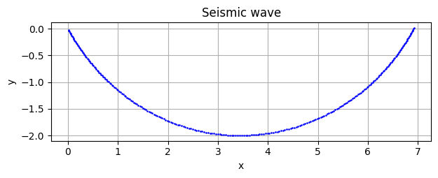

# 五月祭シミュレーション・地震波の伝播

このリポジトリは、五月祭シミュレーションのために作った地震波シミュレーションの試作品です。

> 注意：**GitHub codespaces上で実行しないでください**。生成されるdatファイルのサイズが大きく、codespacesが固まる可能性があります。

## 中身について

- seismic_1 : 深いほど地震波が速くなるような速度プロファイルにおける地震波の経路（初期入射角30度の成分）



- seismic_2 : 深いほど地震波が速くなるような速度プロファイル（段差あり）における**走時曲線**

- seismic_3 : 深いほど地震波が速くなるような速度プロファイル（段差あり）における**波面**の描画

- seismic_4 : 球対称な速度プロファイル（段差あり）における**波面**の描画

## 使い方

### ダウンロード

`git`が使える環境では、`git clone`を使ってリポジトリをダウンロードできます。

```bash
git clone git@github.com:random776/seismic_wave.git
```

`git`を使えない人（特に新3年生）は、掲載されているコードをコピーして、手動でファイルを作成した方が早いかもしれない。

### 実行

fortranのコンパイラが必要です。`gfortran`を使うことをお勧めします。「gfortranのインストール」で検索して、インストールしてください。

```bash
gfortran seismic_1.f90
```

`seismic_1.f90`をコンパイルした後、実行します。

```bash
./a.out
```
次に、pythonを使って、出力されたdatファイルを読み込みます。pythonの実行環境が必要です。`numpy`と`matplotlib`、`scipy` を使いますので、事前にインストールしておいてください。


```bash
python3 seismic_1.py
```
